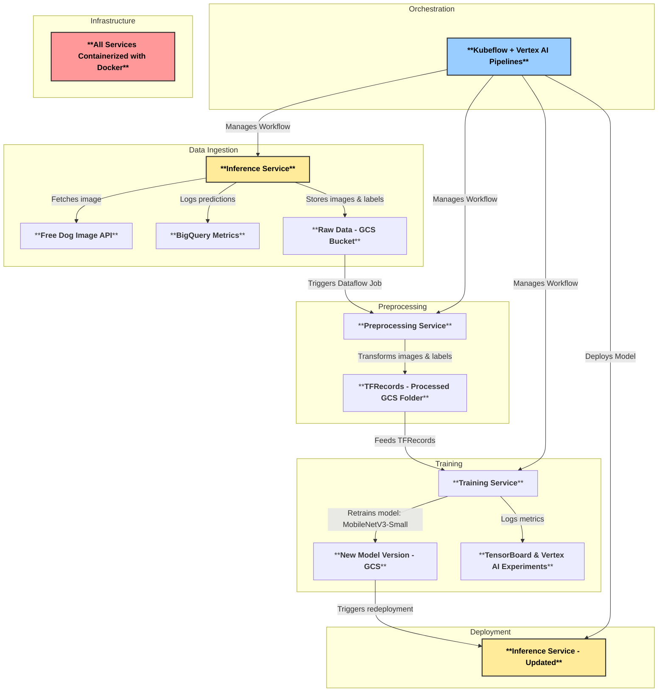
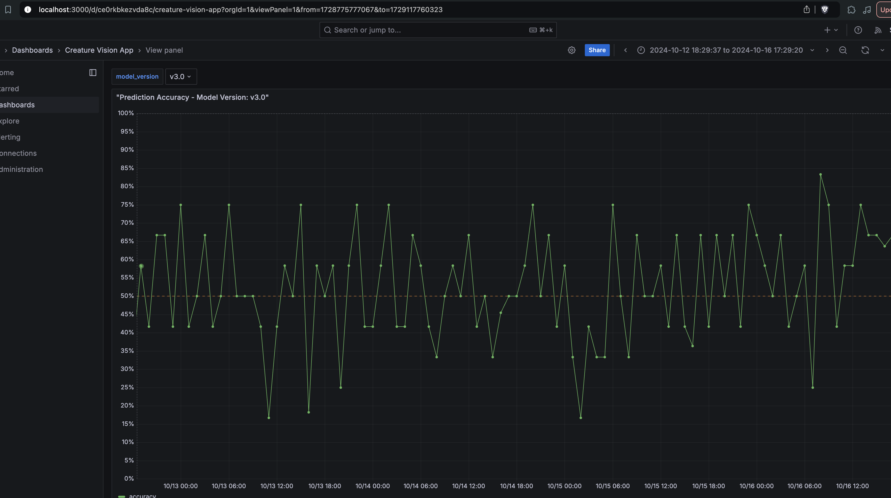

# Creature Vision: Continuous Retraining ML Pipeline

This project implements a **continual learning pipeline** for dog breed classification using **MobileNetV3-Small**. The system employs **automated data collection, preprocessing, training, and deployment**, ensuring that the model continuously improves as new data is accumulated.

## **Overview**

Creature Vision fetches dog images from a **free API**, processes them through an **inference service**, logs **accuracy and latency metrics**, and stores images for **future training**. The system then preprocesses the data, retrains the model on new data, and redeploys it, completing a **self-improving ML pipeline**.

## **Demo Videos**
- [Overview](https://www.youtube.com/watch?v=NxDV6e29O94)
- [Champion/Challenger](https://youtu.be/2J20L-5yWIk)
- [Kubelfow and ML Lifecycle](https://youtu.be/_AHTLu679sg)

## **Key Features**

- **Continuous Learning**: The model is automatically fine-tuned as new labeled data accumulates.
- **Containerized Deployment**: All services (Inference, Preprocessing, Training) are **Dockerized** and deployed in **Cloud Run**.
- **Data-Driven Decision Making**: Metrics (accuracy, latency) are stored in **BigQuery** for monitoring.
- **Scalable Data Processing**: Uses **Apache Beam + Dataflow** to preprocess images into **TFRecords**.
- **Automated Training & Deployment**: **Kubeflow Pipelines + Vertex AI** orchestrate **continual model updates**.

## **Architecture**



## **Workflow**

1. **Inference Service** fetches images from the **Dog API** and logs accuracy & latency metrics in **BigQuery**.
2. It also saves the **raw images & labels** to **Cloud Storage**.
3. **Dataflow Preprocessing** converts raw images into **TFRecords**.
4. **Training Service** loads TFRecords and **re-trains the MobileNetV3-Small model**.
5. Training logs are stored in **Vertex AI Experiments & TensorBoard**.
6. The **new model version** is stored in **GCS**.
7. **Kubeflow Pipelines** redeploy the **Inference Service** with the **updated model**.
8. The cycle repeats, continuously improving model accuracy over time.

## **Technology Stack**

| Component           | Service Used                      |
|--------------------|--------------------------------|
| **Inference**      | Cloud Run + MobileNetV3-Small |
| **Preprocessing**  | Apache Beam + Dataflow        |
| **Training**       | Vertex AI Training            |
| **Storage**        | Cloud Storage (GCS)           |
| **Monitoring**     | BigQuery + TensorBoard        |
| **Orchestration**  | Kubeflow Pipelines + Vertex AI Pipelines |
| **Containerization** | Docker + Artifact Registry  |

## **Getting Started**

### **Prerequisites**
- Google Cloud SDK installed and authenticated
- Docker installed
- Kubeflow Pipelines setup on GCP

### **Setup Instructions**
1. Clone the repository:
   ```sh
   git clone https://github.com/your-repo/creature-vision.git
   cd creature-vision
   ```
2. Build and push images for Inference and Preprocessing services

3. Compile and deploy the kubeflow pipeline

4. Create Cloud function trigger with kubeflow .json and invoke the CF

## **Monitoring & Visualization**

- **BigQuery** stores model accuracy, latency, and retraining metrics.
- **Grafana** visualizes BigQuery metrics:
  ```sh
  docker-compose up grafana
  ```
- **TensorBoard** logs training performance:
  ```sh
  tensorboard --logdir=gs://your-tensorboard-logs/
  ```



## **Fine-Tuning & Continuous Learning**

- **Model is retrained only when new data volume surpasses a threshold**.
- **Fine-tuning follows best practices for transfer learning**:
  - Base Model: **MobileNetV3-Small**
  - Optimizer: **Adam with cosine decay learning rate**
  - Dataset Augmentations: **Random rotation, horizontal flip, brightness adjustments**

### **Reference**
- [TensorFlow Fine-Tuning Guide](https://www.tensorflow.org/tutorials/images/transfer_learning)

